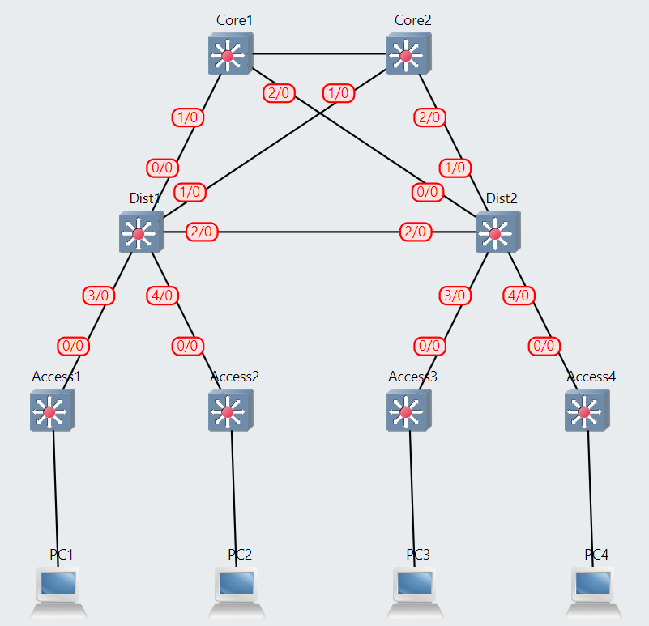

# DevSecOps for Infrastructure As Code

## Prerequisites

Ansible 2.9 or higher
GNS3 2.2 or higher
GNS3 VM running and accessible

```console
ansible-galaxy collection install davidban77.gns3
sudo apt install sshpass
sudo apt-get -y install python-is-python3
```

## Project Structure

```console
.
├── ansible.cfg
├── group_vars
│   └── all.yml
├── inventory
│   └── hosts.yml
├── playbooks
│   └── deploy_network.yml
└── README.md
```

## Deployment

```
ansible-playbook -vvv playbooks/deploy_network.yml --ask-pass
```

## Current status




## Troubleshooting

Actual troubleshooting:

```
failed: [gns3_vm] (item={'node_a': 'Dist2', 'port_a': 4, 'node_b': 'Access4', 'port_b': 0}) => {
    "ansible_loop_var": "item",
    "changed": false,
    "connection": "close",
    "content_length": "60",
    "content_type": "application/json",
    "date": "Thu, 17 Oct 2024 07:04:53 GMT",
    "elapsed": 0,
    "invocation": {
        "module_args": {
            "attributes": null,
            "body": "{\"nodes\": [{\"node_id\": \"aff9a0d6-dcbf-4c76-a1c3-011356004d9a\", \"adapter_number\": 0, \"port_number\": 0}, {\"node_id\": \"2678908b-5a1b-44ac-83e9-03539ba812a4\", \"adapter_number\": 0, \"port_number\": 0}]}",
            "body_format": "json",
            "ca_path": null,
            "ciphers": null,
            "client_cert": null,
            "client_key": null,
            "creates": null,
            "decompress": true,
            "dest": null,
            "follow_redirects": "safe",
            "force": false,
            "force_basic_auth": false,
            "group": null,
            "headers": {
                "Content-Type": "application/json"
            },
            "http_agent": "ansible-httpget",
            "method": "POST",
            "mode": null,
            "owner": null,
            "remote_src": false,
            "removes": null,
            "return_content": false,
            "selevel": null,
            "serole": null,
            "setype": null,
            "seuser": null,
            "src": null,
            "status_code": [
                201
            ],
            "timeout": 30,
            "unix_socket": null,
            "unredirected_headers": [],
            "unsafe_writes": false,
            "url": "http://192.168.238.128:80/v2/projects/31c57064-ce6e-41a1-93e5-18fe71514e83/links",
            "url_password": null,
            "url_username": null,
            "use_gssapi": false,
            "use_netrc": true,
            "use_proxy": true,
            "validate_certs": true
        }
    },
    "item": {
        "node_a": "Dist2",
        "node_b": "Access4",
        "port_a": 4,
        "port_b": 0
    },
    "json": {
        "message": "Port is already used",
        "status": 409
    },
    "msg": "Status code was 409 and not [201]: HTTP Error 409: Conflict",
    "redirected": false,
    "server": "Python/3.8 GNS3/2.2.49",
    "status": 409,
    "url": "http://192.168.238.128:80/v2/projects/31c57064-ce6e-41a1-93e5-18fe71514e83/links",
    "x_route": "/v2/projects/{project_id}/links"
}
```

## To Do

1. Improve architecture 
2. Add security layer
3. Add automation layer
