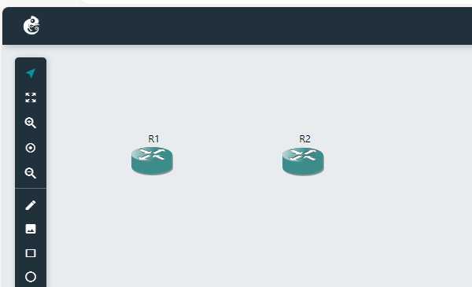

# IaC

## Prerequisites

Ansible 2.9 or higher
GNS3 2.2 or higher
GNS3 VM running and accessible

```console
ansible-galaxy collection install davidban77.gns3
sudo apt install sshpass
sudo apt-get -y install python-is-python3
```

## Project Structure

```console
.
├── ansible.cfg
├── group_vars
│   └── all.yml
├── inventory
│   └── hosts.yml
├── playbooks
│   └── deploy_network.yml
└── README.md
```

## Deployment

```
ansible-playbook -vvv playbooks/deploy_network.yml --ask-pass
```

## Current status




## Troubleshooting

If you encounter any issues, check the Ansible log file at `~/ansible.log` for detailed error messages.
