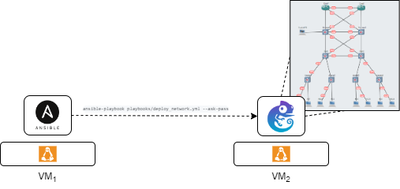
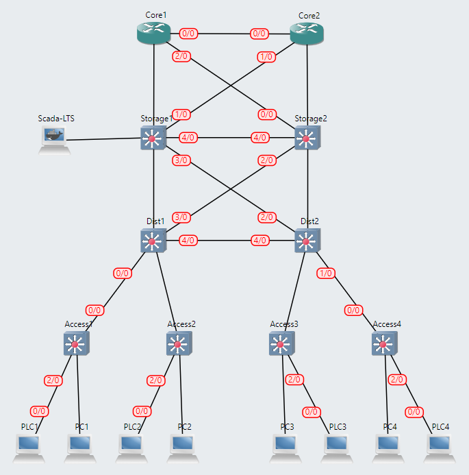

# DevSecOps for Infrastructure As Code



## Prerequisites

- Ansible 2.9 or higher

    ```console
    sudo apt install python3-pip
    python3 -m pip install --user ansible
    python3 -m pip install --user ansible-core
    ```

- Requirements

    ```console
    sudo apt install sshpass
    sudo apt-get -y install python-is-python3
    ```

- Add-on

    ```console
    ansible-galaxy collection install davidban77.gns3
    ```

- GNS3 2.2 or higher as VM Server

## Project Structure

```console
.
├── ansible.cfg
├── group_vars
│   └── all.yml
├── inventory
│   └── hosts.yml
├── playbooks
│   └── deploy_network.yml
└── README.md
```

## Current status of automatic deployment of Spine-leaf architecture



## Deployment

```
ansible-playbook playbooks/deploy_network.yml --ask-pass
```

- One network is deployed:
    - OpenPLC:
        1. Configure OpenPLC to change HTTP port in the container to `8080`.
        2. Play OpenPLC:
            - URL: http://{GNS3_Server_IP}:{PORT}/login
            - username: openplc
            - password: openplc
    - Scada-LTS:
        1. Configure Scada-LTS to change HTTP port in the container to `8080`.
        2. Play Scada-LTS:
            - URL: http://{GNS3_Server_IP}:{PORT}/Scada-LTS/login.htm
            - username: admin
            - password: admin

## Troubleshooting

## To Do

1. Improve architecture:
    1. [Add Digital Twin](https://github.com/borgestassio/Wind-Turbine-Control)
    2. Test Codesys PLC
2. Add security layer
3. Add configuration files (e.g., VLAN, segregations, etc.)
4. Add security layer based on Ansible playbooks
5. Add automation layer based on GitLab pipelines.
6. Avoid ansible controller installation:
    
    `docker pull adosztal/network_automation:latest`
    
    ```console
    docker run -it --rm --name automation \
        -v "$(pwd)/IaC_GNS3":/root/ansible \
        --workdir /root/ansible \
        -e ANSIBLE_HOST_KEY_CHECKING=False \
        adosztal/network_automation \
        bash -c "apt-get update --allow-insecure-repositories && apt-get install -y sshpass && ansible-playbook playbooks/deploy_network.yml -i inventory/hosts --ask-pass"
    ```
